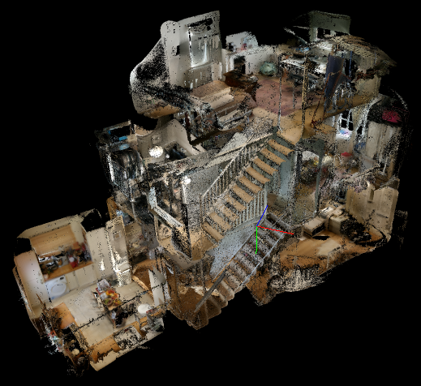

# Collaborative SLAM Dataset (CSD)



*Project page:* [http://www.robots.ox.ac.uk/~tvg/projects/CollaborativeSLAM]

This is the dataset associated with our ISMAR 2018 paper on collaborative large-scale dense 3D reconstruction (see below). Our dataset comprises 4 different subsets - Flat, House, Priory and Lab - each containing a number of different sequences that can be successfully relocalised against each other. Detailed information about the sequences in each subset can be found in the supplementary material for our paper.

Each sequence was captured at 5Hz using an Asus ZenFone AR augmented reality smartphone, which produces depth images at a resolution of 224x172, and colour images at a resolution of 1920x1080. To improve the speed at which we were able to load sequences from disk, we resized the colour images down to 480x270 (i.e. 25% size) to produce the collaborative reconstructions we show in the paper, but we nevertheless provide both the original and resized images as part of the dataset. We also provide the calibration parameters for the depth and colour sensors, the 6D camera pose at each frame, and the optimised global pose produced for each sequence when running our approach on all of the sequences in each subset. Finally, we provide a pre-built mesh of each sequence, pre-transformed by its optimised global pose to allow the sequences from each subset to be loaded into MeshLab or CloudCompare with a common coordinate system.

## Acknowledgements

We gratefully acknowledge the help of Christopher (Kit) Rabson in setting up the hosting for this dataset.

## Publications

If you use this dataset for your research, please cite the following paper:
```
@article{Golodetz2018,
author = {Stuart Golodetz* and Tommaso Cavallari* and Nicholas A Lord* and Victor A Prisacariu and David W Murray and Philip H S Torr},
title = {{Collaborative Large-Scale Dense 3D Reconstruction with Online Inter-Agent Pose Optimisation}},
journal = {TVCG (ISMAR Special Issue)},
year = {2018}
}
```

# Installation Guide

## 1. Downloading the Dataset

1. Choose a directory for the dataset, hereafter referred to as `<dir>`.

2. Clone the CollaborativeSLAMDataset repository into `<dir>`.

3. Change to the dataset directory:

   ```
   $ cd <dir>
   ```

4. Run the normal download script:

   ```
   $ ./download-normal.sh
   ```

5. Run the big download script to download the full-size sequences (optional):

   ```
   $ ./download-big.sh
   ```

## 2. Running Global Reconstructions

1. Install SemanticPaint by following the instructions at [https://github.com/torrvision/spaint].

2. Run the global reconstruction script, specifying the necessary parameters, e.g.

   ```
   $ ./reconstruct-global.sh Flat frames_resized /c/spaint/build/bin/apps/spaintgui/spaintgui
   ```

   Note that the second and third parameters default to `frames_resized` and `/c/spaint/build/bin/apps/spaintgui/spaintgui`, respectively.

## 3. Running Collaborative Reconstructions

1. Install SemanticPaint by following the instructions at [https://github.com/torrvision/spaint].

2. Run the collaborative reconstruction script, specifying the necessary parameters, e.g.

   ```
   $ ./reconstruct-collaborative.sh Flat frames_resized /c/spaint/build/bin/apps/spaintgui/spaintgui
   ```

   Note that the second and third parameters default to `frames_resized` and `/c/spaint/build/bin/apps/spaintgui/spaintgui`, respectively.

# Hints and Tips

* You can generate a single sequence of posed RGB-D frames for each subset of the dataset by running the `reconstruct-global.sh` script and saving the sequence to disk in `spaintgui`.

# Licence

This dataset is licensed under a CC-BY-SA licence. See [https://creativecommons.org/licenses/by-sa/4.0/legalcode] for the full legal text.

SemanticPaint itself is licensed separately - see the SemanticPaint repository for details.

# History

* 2018-OCT-17: first public release
